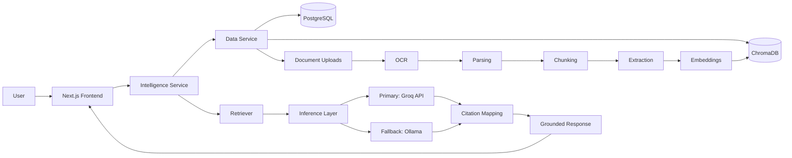

# OPSBRAIN

> AI-powered industrial knowledge intelligence platform that transforms engineering documents into a searchable semantic knowledge base using Retrieval-Augmented Generation, semantic search, and conversational AI.


## Table of Contents

- [Overview](#overview)
- [Problem Statement](#problem-statement)
- [Solution](#solution)
- [Key Capabilities](#key-capabilities)
- [Architecture](#architecture)
- [Design Principles](#design-principles)
- [Technology Stack](#technology-stack)
- [Repository Structure](#repository-structure)
- [Backend Architecture](#backend-architecture)
- [AI Pipeline](#ai-pipeline)
- [Inference Strategy](#inference-strategy)
- [API Overview](#api-overview)
- [Getting Started](#getting-started)
- [Configuration](#configuration)
- [Development Workflow](#development-workflow)
- [Roadmap](#roadmap)
- [Contributing](#contributing)
- [Project Status](#project-status)
- [License](#license)
- [Acknowledgements](#acknowledgements)

## Overview

Modern industrial facilities generate large volumes of technical documentation: equipment manuals, maintenance logs, inspection reports, standard operating procedures, and incident reports. This information is valuable but hard to use, since it is stored as unstructured PDFs spread across multiple systems. Finding a single answer often means manually reading hundreds of pages and tracing references across different reports.

OPSBRAIN converts industrial documents into a structured semantic knowledge base. An automated ingestion pipeline extracts information from uploaded documents, generates vector embeddings, builds searchable relationships, and lets engineers retrieve grounded answers through natural language conversations with full citation support.

Instead of searching by filename or keyword, users ask questions directly:

> "What maintenance procedure should be followed for Pump P-101A?"

> "Show previous inspection findings related to compressor vibration."

The system retrieves relevant knowledge from indexed documents and returns answers backed by traceable citations pointing to the original source pages.

## Problem Statement

Industrial organizations face recurring challenges when managing technical knowledge:

| Challenge | Impact |
|---|---|
| Large collections of documentation stored as static PDFs | Knowledge is difficult to search or reuse |
| Manual search across multiple documents | Answering a single question can take hours |
| Knowledge scattered across manuals, reports, and logs | No single source of truth for equipment history |
| Difficulty tracing relationships between equipment, failures, and procedures | Root cause analysis is slow and error-prone |
| No conversational interface backed by trusted sources | Engineers fall back to tribal knowledge instead of documentation |

Traditional keyword search retrieves documents. OPSBRAIN retrieves knowledge.

## Solution

OPSBRAIN combines AI retrieval techniques with structured document processing in a single pipeline. Uploaded documents are ingested, OCR'd when needed, parsed, and split into semantic chunks, then mined for engineering entities and relationships. Each chunk is embedded and stored alongside structured metadata, making it retrievable through semantic search.

When a user asks a question, the platform retrieves the most relevant chunks, assembles them into context, and generates a citation-aware response through Retrieval-Augmented Generation. Response generation is served primarily through the Groq API, with automatic fallback to a locally hosted Ollama model if Groq is unavailable, keeping every answer grounded in the underlying documentation regardless of which inference path is used.

## Key Capabilities

### Document Intelligence

| Capability | Description |
|---|---|
| PDF ingestion | Automated ingestion pipeline for industrial PDF documents |
| OCR | Extracts text from scanned engineering documents |
| Document parsing | Identifies structure within ingested documents |
| Semantic chunking | Splits documents into section-aware semantic chunks |
| Metadata enrichment | Attaches structured metadata to each processed document |
| Embedding generation | Produces dense vector embeddings for semantic search |

### Knowledge Processing

| Capability | Description |
|---|---|
| Entity extraction | Identifies engineering entities such as equipment and components |
| Relationship extraction | Maps relationships between equipment, failures, and procedures |
| Semantic indexing | Indexes chunks and metadata for retrieval |
| Vector similarity search | Retrieves relevant chunks using dense vector search |
| Conversation memory | Retains context across multi-turn conversations |

### AI Retrieval

| Capability | Description |
|---|---|
| Retrieval-Augmented Generation | Combines retrieval with generation for grounded responses |
| Context assembly | Assembles retrieved chunks into a coherent prompt context |
| Citation verification | Maps generated answers back to source documents |
| Cloud-first inference with local fallback | Runs inference primarily through the Groq API, automatically falling back to a locally hosted Ollama model on failure |

### Platform

| Capability | Description |
|---|---|
| JWT authentication | Secures API access with token-based authentication |
| Document management | Upload tracking and document lifecycle management |
| Conversation history | Persists conversation history across sessions |
| Versioned REST APIs | Exposes functionality through versioned, typed endpoints |
| Next.js dashboard | Web interface for uploads, search, and chat |
| Source document viewer | Displays the original source pages referenced in citations |

## Architecture

The platform follows a two-service architecture that separates persistent data management from AI reasoning.



| Layer | Responsibility |
|---|---|
| Frontend | User interface and interactions |
| Intelligence Service | AI orchestration, retrieval, reasoning |
| Data Service | Document ingestion, storage, indexing |
| PostgreSQL | Structured application data |
| ChromaDB | Semantic vector storage |
| Inference Layer | Response generation via Groq API (primary) with automatic Ollama fallback |

## Design Principles

| Principle | Description |
|---|---|
| Separation of responsibilities | Persistent storage, document processing, and AI orchestration are isolated into independent services, reducing coupling |
| Source-grounded responses | Generated answers stay grounded in retrieved document context instead of relying solely on model knowledge |
| Modular processing pipeline | OCR, parsing, chunking, embedding generation, and entity extraction run as independent stages that can evolve separately |
| API-first communication | The intelligence layer communicates exclusively through versioned REST APIs, keeping services loosely coupled |
| Stateless intelligence layer | The Intelligence Service holds no persistent state; all storage lives in the Data Service |
| Resilient inference | Response generation defaults to the Groq API and transparently falls back to a local Ollama model, so a single provider outage does not interrupt service |

## Technology Stack

| Category | Technologies |
|---|---|
| Frontend | Next.js, React, TypeScript |
| Backend | FastAPI, Python |
| Database | PostgreSQL |
| Vector database | ChromaDB |
| ORM | SQLAlchemy |
| Authentication | JWT |
| AI framework | LangGraph |
| Embeddings | Sentence Transformers |
| Primary inference provider | Groq |
| Fallback inference runtime | Ollama (local) |
| Migrations | Alembic |
| API documentation | OpenAPI / Swagger |

## Repository Structure

```text
OPSBRAIN/
├── backend/
│   ├── agents/
│   ├── alembic/
│   ├── app/
│   │   ├── api/
│   │   ├── core/
│   │   ├── db/
│   │   ├── llm/
│   │   ├── pipeline/
│   │   ├── schemas/
│   │   └── services/
│   ├── chroma_data/
│   ├── rag/
│   └── uploads/
├── frontend/
│   ├── app/
│   ├── components/
│   ├── contexts/
│   ├── lib/
│   └── public/
├── .gitignore
├── LICENSE
└── README.md
```

## Backend Architecture

The backend handles document ingestion, persistent storage, authentication, indexing, and the APIs consumed by the intelligence layer and frontend.

| Module | Path | Responsibility |
|---|---|---|
| API layer | `app/api/` | Versioned REST endpoints for auth, documents, chat, search, conversations, and health checks |
| Core layer | `app/core/` | Environment configuration, security settings, dependency injection, shared utilities |
| Database layer | `app/db/` | PostgreSQL models, SQLAlchemy sessions, repository implementations, ChromaDB integration |
| Pipeline layer | `app/pipeline/` | OCR, parsing, cleaning, chunking, metadata generation, entity and relationship extraction, embedding generation |
| Service layer | `app/services/` | Business logic for authentication, documents, conversations, search, and embeddings |
| Schema layer | `app/schemas/` | Request and response contracts defined with Pydantic models |

## AI Pipeline

The Intelligence Service is the AI layer of the platform. It holds no persistent storage of its own and focuses entirely on reasoning, retrieval, orchestration, and response generation: semantic retrieval, context assembly, RAG orchestration, citation mapping, prompt construction, conversation reasoning, and agent workflow execution.

**Document processing**

```text
Document Upload → OCR (if required) → Parsing → Cleaning → Semantic Chunking →
Metadata Generation → Entity Extraction → Relationship Extraction → Embedding Generation → Vector Storage
```

**Retrieval-Augmented Generation**

```text
User Question → Query Understanding → Semantic Retrieval → Context Collection →
Prompt Construction → Inference Layer (Groq primary / Ollama fallback) → Citation Mapping → Grounded Response
```

Each stage is intentionally isolated, so components such as the OCR engine, extraction models, embedding provider, or inference backend can be upgraded independently without redesigning the system.

## Inference Strategy

OPSBRAIN uses a two-tier inference strategy to balance response quality, latency, and availability:

- **Primary: Groq API.** Under normal operating conditions, all response generation is routed through the Groq API for fast, high-throughput inference.
- **Fallback: Ollama (local).** If a Groq request fails due to API errors, network failures, rate limits, or temporary service outages, the backend automatically retries the request against a locally hosted Ollama model.
- **Automatic failover.** Fallback is triggered transparently within the inference layer; no changes to the request, the calling service, or the user experience are required.
- **Graceful degradation.** In the event of a sustained Groq outage, the system continues serving grounded, citation-backed responses through the local model rather than failing the request.
- **Continued local operation.** Because Ollama runs locally, the platform can keep answering questions even without external network connectivity to the Groq API, at the cost of reduced throughput compared to the primary path.

This strategy keeps the Intelligence Service stateless and provider-agnostic: retrieval, context assembly, and citation mapping are unaffected by which inference backend ultimately generates the response.

## API Overview

| Endpoint | Purpose |
|---|---|
| `/api/v1/auth` | User authentication |
| `/api/v1/documents` | Document upload and management |
| `/api/v1/search` | Semantic search |
| `/api/v1/chat` | Conversational interface |
| `/api/v1/conversations` | Conversation history |
| `/api/v1/graph` | Knowledge graph queries |
| `/api/v1/health` | Service health monitoring |

## Getting Started

### Prerequisites

| Requirement | Version / Notes |
|---|---|
| Python | 3.11+ |
| Node.js | 18+ |
| PostgreSQL | Latest |
| Ollama | Latest (required for local fallback inference) |
| Groq API key | Active account (required for primary inference) |
| Git | Latest |

### Clone the repository

```bash
git clone https://github.com/animesh8787/AI-powered-Industrial-Knowledge-Intelligence-Platform.git
cd AI-powered-Industrial-Knowledge-Intelligence-Platform
```

### Backend setup

```bash
cd backend
python -m venv venv

# Windows
venv\Scripts\activate

# Linux / macOS
source venv/bin/activate

pip install -r requirements_data_service.txt
uvicorn app.main:app --reload
```

The backend starts on `http://localhost:8000`.

### Frontend setup

```bash
cd frontend
npm install
npm run dev
```

The frontend starts on `http://localhost:3000`.

## Configuration

Create a `.env` file inside the `backend` directory:

```env
DATABASE_URL=
CHROMA_PATH=
JWT_SECRET=
GROQ_API_KEY=
OLLAMA_BASE_URL=
```

`GROQ_API_KEY` configures the primary inference provider. `OLLAMA_BASE_URL` points to a locally hosted Ollama instance and is required for automatic fallback if Groq requests fail. Fill in these values for your local development environment.

## Development Workflow

1. Upload industrial documents.
2. Process documents through the ingestion pipeline.
3. Extract structured information.
4. Generate vector embeddings.
5. Store metadata and vectors.
6. Accept natural language questions.
7. Retrieve relevant document context.
8. Generate grounded responses through the Groq API, falling back to Ollama automatically if needed.
9. Return citations linked to the original source.

Document processing stays independent from conversational reasoning, which keeps future feature development straightforward.

## Roadmap

| Area | Planned Improvement |
|---|---|
| Retrieval | Hybrid keyword and vector retrieval, multi-document reasoning |
| Document intelligence | Improved OCR accuracy, expanded knowledge graph capabilities, advanced document analytics |
| Platform | Role-based access control, multi-tenant deployments, fine-grained permission management |
| Delivery | Streaming AI responses, cloud-native deployment, distributed embedding generation, real-time collaboration |

## Contributing

Contributions are welcome.

1. Fork the repository.
2. Create a feature branch.

   ```bash
   git checkout -b feature/my-feature
   ```

3. Commit your changes.

   ```bash
   git commit -m "Add new feature"
   ```

4. Push the branch.

   ```bash
   git push origin feature/my-feature
   ```

5. Open a pull request.

New features should include documentation and follow the existing project structure.

## Project Status

OPSBRAIN is under active development. Current work focuses on document intelligence, retrieval quality, conversational reasoning, and developer experience, while keeping the service-oriented architecture clean.

## License

This project is licensed under the MIT License. See the [LICENSE](LICENSE) file for details.

## Acknowledgements

Developed for the ET AI Hackathon 2026 under Problem Statement 8. The project applies Retrieval-Augmented Generation, semantic search, knowledge extraction, vector databases, and conversational interfaces to improve access to industrial knowledge in engineering documentation.
